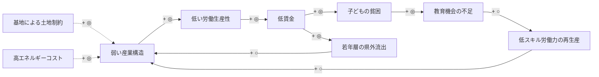
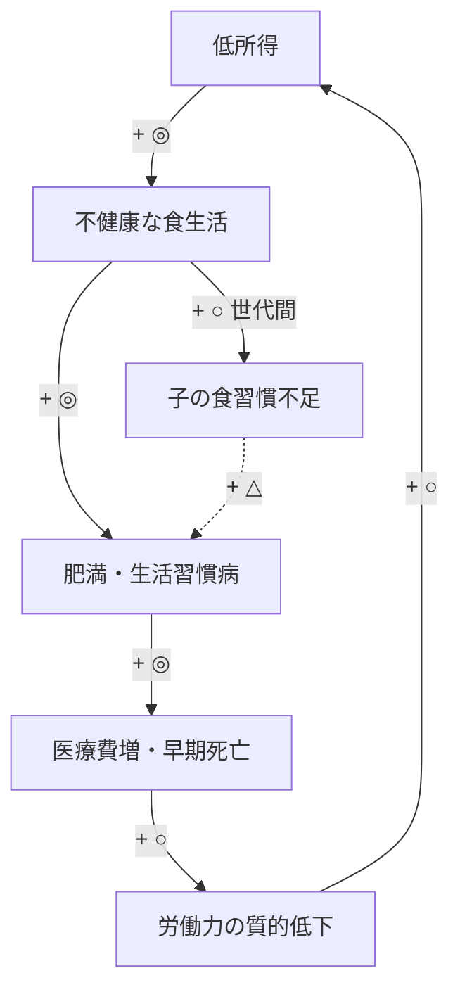
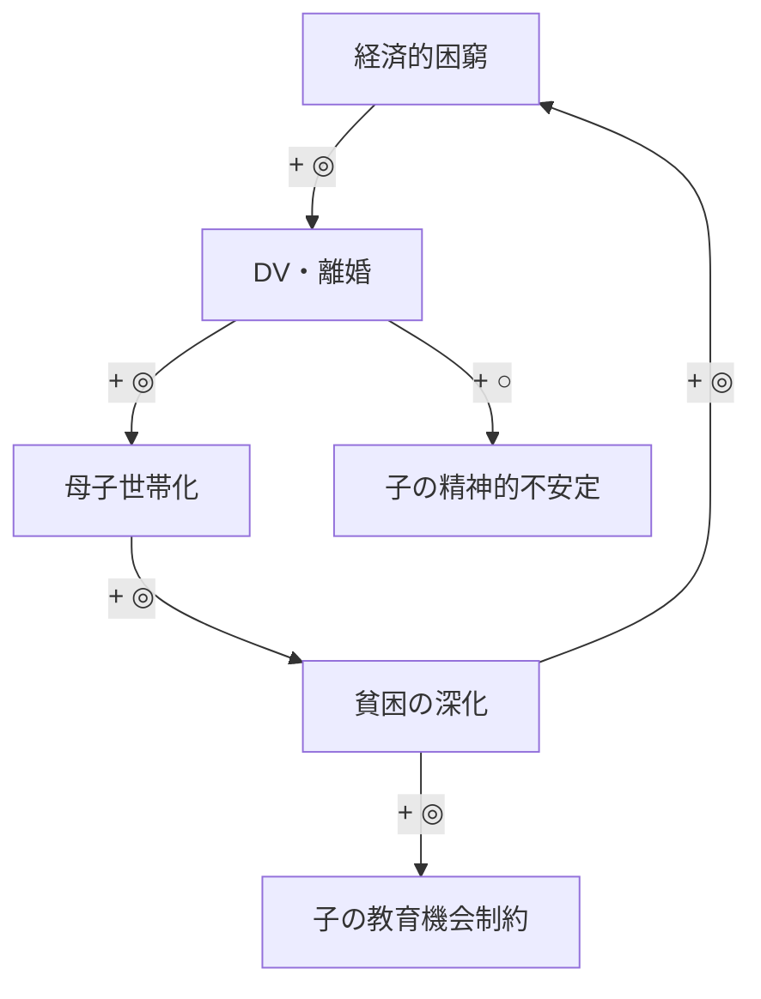
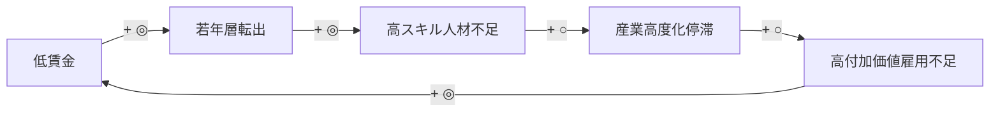
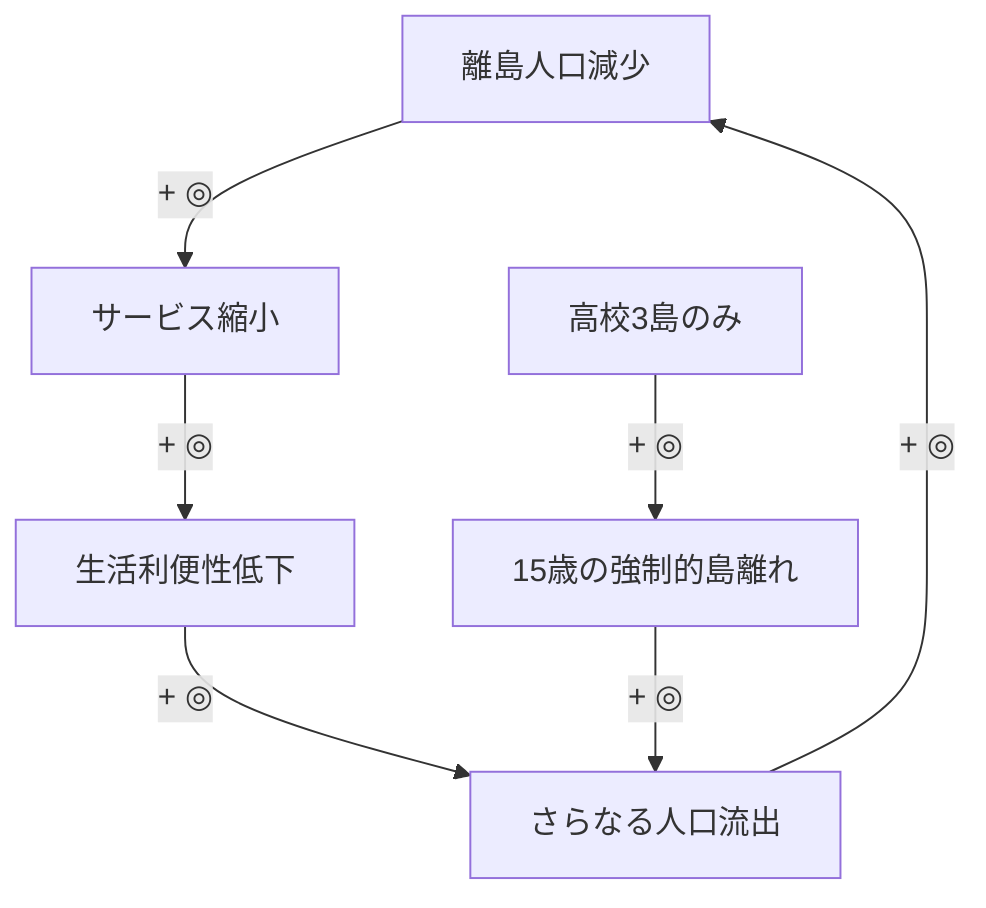

# 沖縄県 現状分析・因果構造分析報告書

**「沖縄県総合発展マスタープラン」策定プロセス Step 1 成果物**

作成日：2026年3月
版数：v1.0

---

本報告書は、「沖縄県総合発展マスタープラン」（6層構造の多層的計画フレームワーク）の策定プロセスにおけるStep 1「現状分析・課題構造化」に対応する成果物である。

**上位文書との関係：**
- 計画策定仕様書（全体アーキテクチャ）→ 本報告書はそのStep 1
- L0・L1統合ドキュメント（2075年ビジョン）→ トップダウン軸の入力。本報告書はボトムアップ軸
- 次工程：本報告書の分析結果がL2（戦略層・10年・2035年）の策定に入力される

---

## 目次

### 第1部：現状分析

- [第1章：経済生産性（重点章）](#第1章経済生産性重点章)
- [第2章：子どもの貧困（重点章）](#第2章子どもの貧困重点章)
- [第3章：教育⇒雇用パイプライン（重点章）](#第3章教育雇用パイプライン重点章)
- [第4章：人口動態（準重点章）](#第4章人口動態準重点章)
- [第5章：健康アウトカム](#第5章健康アウトカム)
- [第6章：米軍基地問題（経済的側面）](#第6章米軍基地問題経済的側面)
- [第7章：離島条件不利](#第7章離島条件不利)
- [第8章：エネルギー依存](#第8章エネルギー依存)

### 第2部：因果構造分析

- [第9章：8領域の因果マッピング](#第9章8領域の因果マッピング)
- [第10章：負のスパイラル仮説の検証](#第10章負のスパイラル仮説の検証)
- [第11章：レバレッジポイントの評価](#第11章レバレッジポイントの評価)

### 第3部：L2戦略層への接続

- [第12章：L2（戦略層）への入力事項](#第12章l2戦略層への入力事項)

### 付録

- [付録：データソース一覧](#付録データソース一覧)

---

# 第1部：現状分析

---

## 第1章：経済生産性（重点章）

### 1.1 現状概要

沖縄県の経済は、復帰から半世紀を経てなお構造的な低生産性から脱却できていない。2022年度の1人当たり県民所得は224.9万円であり、全国平均（約319万円）の約70%にとどまる。この全国最下位の状態は27年以上にわたって継続しており、もはや景気循環や一時的要因では説明できない構造的問題である。

沖縄経済の最大の特徴は、第3次産業への極端な偏重にある。県内総生産に占める第3次産業の構成比は85.9%に達し、全国平均の約73%を大きく上回る。一方、第2次産業は13.1%と全国平均の約半分にすぎず、とりわけ製造業のGDP構成比は4.3〜4.5%と全国（20.7%）の約5分の1という水準にある。この産業構造の歪みは、1945年から1972年までの米軍統治期に日本本土が経験した高度経済成長期の産業基盤投資を沖縄が受けられなかったという歴史的断絶に根本原因がある。

ただし、近年の沖縄経済には変化の兆しも認められる。完全失業率は2015年の5.1%から2024年には3.2%まで改善し、観光収入は2023年度に過去最高の8,507億円を記録した。最低賃金も2020年の792円から2025年には1,023円へと上昇し、全国平均との格差は縮小傾向にある。問題は、こうした量的改善が質的な構造転換を伴っているか否かである。

### 1.2 主要データ

**表1-1：1人当たり県民所得の推移**

| 年度 | 沖縄県（万円） | 全国平均（万円） | 対全国比 | 備考 |
|------|--------------|----------------|---------|------|
| 2015 | 約217 | — | — | — |
| 2019 | 241 | — | — | 過去最高 |
| 2022 | 224.9 | 約319 | 約70% | 全国最下位（27年以上連続） |

出典：内閣府「県民経済計算」各年版

**表1-2：県内総生産の産業別構成比**

| 産業区分 | 沖縄県 | 全国平均 | 差分 |
|----------|--------|---------|------|
| 第1次産業 | 約1% | — | — |
| 第2次産業 | 13.1% | 約26% | ▲約13pt |
| 　うち製造業 | 4.3〜4.5% | 20.7% | ▲約16pt |
| 第3次産業 | 85.9% | 約73% | +約13pt |

出典：内閣府「県民経済計算」、沖縄県「県民所得統計」

**表1-3：労働生産性の全国比較（全国＝100）**

| 指標 | 沖縄 | 備考 |
|------|------|------|
| 全産業 | 60.2 | — |
| 製造業 | 61.6 | — |
| 1人当たり純付加価値額の差 | — | 全国より238.4万円低い |

出典：りゅうぎん総合研究所（2023年）

**表1-4：雇用関連指標**

| 指標 | 沖縄県 | 全国平均 | 備考 |
|------|--------|---------|------|
| 完全失業率（2024年） | 3.2% | 2.5% | 全国ワースト1位 |
| 非正規雇用率（2022年） | 約39.6% | 36.9% | 41位に改善 |
| 最低賃金（2025年） | 1,023円 | 1,121円 | 差98円 |

出典：総務省「労働力調査」、厚生労働省「地域別最低賃金」

**表1-5：観光関連指標**

| 指標 | 数値 | 備考 |
|------|------|------|
| 入域観光客数（2024年） | 966.9万人 | 2019年比95%回復 |
| 観光収入（2023年度） | 8,507億円 | 過去最高 |
| 1人当たり消費額 | 約10万円 | 単価上昇傾向 |

出典：沖縄県文化観光スポーツ部「観光統計」

### 1.3 構造的要因分析

**第一の要因：歴史的断絶——米軍統治期の産業基盤投資の欠如**

1945年から1972年の27年間、沖縄は米軍の施政権下に置かれ、日本本土が経験した高度経済成長期の恩恵を直接受けることができなかった。本土では重化学工業の立地、産業インフラ整備が進み、製造業を基軸とする産業構造が確立された。沖縄ではこの時期、基地建設と基地関連サービス業が経済の中心を占め、自立的な産業基盤の形成は著しく遅れた。

**第二の要因：産業構造の偏重**

第3次産業の構成比85.9%の問題の本質は、内部構成にある。沖縄の第3次産業は観光関連サービス、小売・飲食、公務・公的サービスが大きな比重を占め、これらは一般に労働集約的で付加価値生産額が低い。りゅうぎん総合研究所（2023年）の分析では、近年は「労働生産性の差」そのものが所得格差の主因に変化している。

**第三の要因：製造業の質的脆弱性**

製造業全体の約40%を食料品製造業が占め、高付加価値型製造業の集積は極めて薄い。島嶼県の地理的制約に加え、電力コストの高さが製造業の立地を困難にしている。

**第四の要因：雇用の質と人的資本**

非正規雇用率39.6%に示されるように雇用の質的改善は緩慢である。観光業を中心とするサービス業は非正規・低賃金の雇用を生み出しやすい構造を持つ。

**第五の要因：観光産業の量から質への転換途上**

1人当たり消費額の約10万円への上昇は単価向上の萌芽だが、高付加価値型観光への質的転換がさらに求められる。

### 1.4 他領域との因果関係（予備的整理）

**基地問題との関係：** 県土の8.2%を占拠する米軍基地は都市計画の制約、産業用地の不足、道路ネットワークの分断を通じて経済活動を阻害している。返還跡地で経済効果32倍（那覇新都心）はこの制約の大きさを逆証明する。GW2050 PROJECTSの4エリア一体開発は産業構造転換のポテンシャルを有する。

**エネルギー依存との関係：** 産業用電力コスト全国平均の約2倍は製造業誘致の最大障壁である。エネルギー自給率2.7%は化石燃料価格変動リスクを県内に転嫁させ、全産業の生産性を構造的に押し下げている。

**人口・教育との関係：** 低賃金・非正規雇用は若年層の県外流出を促し、高度人材の不足が生産性をさらに押し下げる負の循環が存在する。

---

## 第2章：子どもの貧困（重点章）

### 2.1 現状概要

沖縄県の子どもの貧困率は、2015年の29.9%から2024年の21.8%へと8.1ポイント改善した。しかし、2024年時点でもなお全国平均（約11.5%）の約1.9倍であり、県内の子どもの約5人に1人が困窮状態にある。

さらに注視すべきは、統計上の貧困率が改善する一方で、困窮世帯の生活実感はむしろ悪化している点である。中2保護者（困窮層）の食料困窮経験率は2015年の48.7%から2024年には58.2%へと9.5ポイント上昇した。名目的な貧困率の改善と実質的な生活困窮の深刻化という乖離は、本章の分析を貫く重要な論点である。

前章で明らかにした経済の構造的低生産性と低賃金が、子どもの貧困の根底にある経済的基盤を規定している。

### 2.2 主要データ

**表2-1：子どもの困窮層割合の推移**

| 年度 | 沖縄県 | 全国平均 | 対全国倍率 |
|------|--------|---------|-----------|
| 2015年 | 29.9% | 約13.9% | 2.15倍 |
| 2021年 | 23.2% | 約11.5% | 2.02倍 |
| 2024年 | 21.8% | 約11.5% | 1.90倍 |

出典：沖縄県子どもの貧困実態調査、内閣府

**表2-2：貧困関連構造指標**

| 指標 | 沖縄県 | 全国平均 | 全国順位 |
|------|--------|---------|---------|
| 離婚率（人口千対、2024年） | 2.24 | 1.55 | 1位（22年連続） |
| 母子世帯出現率 | 2.6% | 1.4% | 1位 |
| 就学援助率（2023年） | 23.57% | 13.66% | 2位 |
| DV保護命令（人口10万対、2023年） | 3.3件 | — | 2位 |
| 生活保護率（2024年） | 26.89‰ | 16.2‰ | 3位 |

出典：厚生労働省、文部科学省、裁判所司法統計

**表2-3：困窮層の食料困窮経験（中2保護者）**

| 指標 | 2015年 | 2024年 | 変化 |
|------|--------|--------|------|
| 食料困窮経験 | 48.7% | 58.2% | +9.5pt |

出典：沖縄県子どもの貧困実態調査

### 2.3 構造的要因分析

**第一：ひとり親世帯の高比率と経済的脆弱性。** 離婚率22年連続全国1位、母子世帯出現率全国1位である。DV発生率の高さが複合的に作用している。

**第二：低賃金・非正規雇用中心の労働市場。** 第1章で示した構造的低賃金が「働いても貧困から抜け出せない」ワーキングプア構造を形成している。

**第三：物価高騰による実質的生活水準の悪化。** 島嶼県の高物流コストに全国的な物価上昇が上乗せされ、困窮世帯の生活を直撃している。

**第四：セーフティネットへの接続の不十分さ。** 生活保護率が過去最多を更新しているにもかかわらず、制度の捕捉率は依然として低い。

### 2.4 他領域との因果関係

**教育との関係：** 困窮世帯の子どもの学力格差（中学数学-10.3pt）、進学率格差の一因となっている。「低所得→教育機会喪失→低スキル就労→低所得」の世代間連鎖を形成する。この連鎖は次章の教育パイプラインの課題へ直接つながる。

**人口動態との関係：** 子育てコスト高が出産抑制を通じて少子化を加速させている。

**健康との関係：** 食料困窮が栄養偏りを生じさせ、肥満・生活習慣病の世代間伝達の一因となっている。「若い世代ほど健康指標が悪い」世代間二重構造（第5章で詳述）の背景要因である。

---

## 第3章：教育⇒雇用パイプライン（重点章）

### 3.1 現状概要

前章で示した子どもの貧困は、教育から雇用へのパイプラインの入口品質を直接規定している。パイプラインは入口（基礎学力）、中間（進路選択・高等教育）、出口（就労）のいずれの段階でも全国との格差を抱えている。大学進学率46.7%は全国最下位（全国61.8%、-15.1pt）、無業者率11.7%は全国4.9%の2.4倍でワーストである。不登校率は小学校で全国ワーストとなっている。

### 3.2 主要データ

**表3-1：全国学力テスト（2025年）**

| 教科 | 沖縄県 | 全国平均 | 差 |
|------|--------|---------|------|
| 小学・国語 | 64.0% | 66.8% | -2.8pt |
| 小学・算数 | 51.0% | 58.0% | -7.0pt |
| 中学・国語 | 49.0% | 54.3% | -5.3pt |
| 中学・数学 | 38.0% | 48.3% | -10.3pt |

出典：文部科学省全国学力・学習状況調査

**表3-2：不登校（2024年度）**

| 指標 | 沖縄県 | 全国 |
|------|--------|------|
| 小中合計 | 7,432人 | — |
| 小学校千人あたり | 35.4人 | 約23人 |
| 増加傾向 | 11年連続増加・過去最多 | — |

出典：文部科学省

**表3-3：高校卒業後の進路（2025年）**

| 進路 | 沖縄県 | 全国平均 | 全国順位 |
|------|--------|---------|---------|
| 大学進学率 | 46.7% | 61.8% | 最下位 |
| 専門学校進学率 | 25.6% | 15.5% | 1位 |
| 無業者率 | 11.7% | 4.9% | ワースト |

出典：文部科学省学校基本調査

### 3.3 構造的要因分析

**第一：基礎学力形成段階の複合的不利。** 中学数学-10.3ptの格差はSTEM分野の進路を構造的に狭める。

**第二：経済的制約による進路選択の歪み。** 大学進学率が全国を15.1pt下回る一方、専門学校進学率は全国を10.1pt上回り全国1位である。4年制大学の費用を負担できない世帯が専門学校を選択する構造が存在する。

**第三：高校中退と無業の発生。** 中退率2.1%はワーストであり、無業者率11.7%は就労接続の不全を示している。

**第四：人材流出。** 2024年の転出超過-1,529人は19-24歳が中心である。県内に受け皿となる高付加価値雇用が不足している。

### 3.4 他領域との因果関係

**子どもの貧困からの流入：** 前章で分析した困窮世帯の教育達成阻害がパイプライン入口の品質を規定している。

**経済構造への送出：** 低スキル若年層の社会送出が第1章で示した低生産性構造を再生産する。ここに、経済→貧困→教育→経済という主たる負の循環の全体像が浮かび上がる。

**人口動態との関係：** 19-24歳の転出超過が示すように、パイプラインの不全が直接人口流出につながっている。

---

## 第4章：人口動態（準重点章）

### 4.1 現状概要

第1〜3章で示した経済・貧困・教育の構造的課題は、人口動態に集約的に表出する。総人口約146.6万人（2024推計）は3年連続で減少している。社人研推計では2050年に約126万人まで減少する見通しである。合計特殊出生率（TFR）は2015年の1.96から2024年の1.54へと0.42ポイント低下した。40年連続全国1位を維持するが、低下速度は全国平均を上回る。2024年の社会増減は-1,529人の転出超過である。

### 4.2 主要データ

**表4-1：将来人口推計**

| 年次 | 推計人口 | 2024年比 |
|------|---------|---------|
| 2024年 | 約146.6万人 | — |
| 2030年 | 約143万人 | -2.5% |
| 2040年 | 約136万人 | -7.2% |
| 2050年 | 約126万人 | -14.1% |

出典：国立社会保障・人口問題研究所

**表4-2：合計特殊出生率（TFR）の推移**

| 年次 | 沖縄県 | 全国順位 |
|------|--------|---------|
| 2015年 | 1.96 | 1位 |
| 2020年 | 1.86 | 1位 |
| 2024年 | 1.54 | 1位（40年連続） |

出典：厚生労働省

### 4.3 構造的要因分析

**TFR急落の背景：** 若年層の経済基盤の脆弱さ（第1章）、子育てコスト上昇、晩婚化・非婚化の進行が複合的に作用している。

**社会増減の反転：** 2024年の転出超過-1,529人は、19-24歳層の構造的流出が持続していることを示す。第3章で分析した教育パイプラインの出口問題と直結している。

**本島集中と離島過疎の二極化：** 本島が人口倍増する一方、離島は約4万人を喪失している。この二極化は第7章で詳述する。

### 4.4 他領域との因果関係

**子どもの貧困・教育からの影響：** TFR低下は将来不安の帰結であり、第2章・第3章の課題が人口動態に集約的に表れている。

**経済との双方向関係：** 人口減少→労働力縮小→経済縮小→更なる人口流出という負の循環が形成されている。

**離島への影響：** 人口減少が離島で最も先鋭的に顕在化しており、第7章の離島条件不利の分析へ接続する。

---

## 第5章：健康アウトカム

### 5.1 現状概要

沖縄県の健康アウトカムは、「かつての長寿県」から「若い世代ほど不健康な県」へと変容している。男性平均寿命は1985年全国1位から2020年43位へ急落した。健康寿命（2022年）は男性45位、女性46位であり、女性は2019年の25位から21ランク急落している。注目すべきは世代間二重構造である。75歳以上は男性2位・女性1位だが、20歳・40歳時の平均余命は男性43位となっている。「若い人ほど寿命が短い」構造が存在する。

この世代間二重構造の背景には、第2章で分析した子どもの貧困による食料困窮と、第1章で示した低所得構造が健康行動を規定するメカニズムがある。

### 5.2 主要データ

**表5-1：平均寿命の推移（男性）**

| 年次 | 平均寿命 | 全国順位 |
|------|---------|---------|
| 1985年 | — | 1位 |
| 2000年 | — | 26位 |
| 2020年 | 80.73歳 | 43位 |

出典：厚生労働省都道府県別生命表

**表5-2：健康関連指標**

| 指標 | 沖縄県 | 全国比・順位 |
|------|--------|------------|
| 健康寿命・男性 | — | 45位 |
| 健康寿命・女性 | — | 46位 |
| 年齢調整死亡率（20-64歳） | — | 男女とも全国1位（最悪） |
| 肥満率・男性（20歳以上） | 41.6% | — |
| 40-64歳男性肥満率 | 約50% | — |
| アルコール性肝疾患死亡率（男性） | 全国の2.7倍 | 全国1位 |

出典：厚生労働省

### 5.3 構造的要因分析

**食生活の変容と肥満：** 米軍統治期に先行導入された食の欧米化の世代蓄積が、現在の肥満率の高さに表れている。40-64歳男性の肥満率約50%は深刻な水準である。

**アルコール性肝疾患：** 2016年から2023年にかけて78%増と急速に悪化している。

**社会経済的健康格差：** 20-64歳の年齢調整死亡率が男女とも全国最悪であることは、低所得・非正規雇用が構造的に不健康を促進していることを示す。

### 5.4 他領域との因果関係

**子どもの貧困から：** 食料困窮→栄養基盤損傷→成人後の健康リスクという経路が世代を超えて作用している。

**教育から：** 低学歴→健康リテラシー不足→予防行動不足という経路が存在する。

**経済へ：** 働き盛り世代の健康悪化→労働生産性毀損→医療費増大→県財政圧迫という形で、第1章の経済問題にフィードバックする。

---

## 第6章：米軍基地問題（経済的側面）

### 6.1 現状概要

在沖米軍基地は31施設、18,483ha、県土の約8.2%、本島の約14.6%を占拠している。在日米軍専用施設の約70.3%が国土面積0.6%の沖縄に集中している。第1章で示した産業構造の歪みの「外部固定要因」として、基地の存在は空間的・経済的制約を構造化している。

### 6.2 主要データ

**表6-1：基地経済依存度の推移**

| 年 | 県民総所得比 |
|----|------------|
| 1965 | 30.4% |
| 1972 | 15.5% |
| 2019 | 5.5%（2,712億円） |

出典：沖縄県基地対策課

**表6-2：返還跡地の経済効果**

| 地区 | 指標 | 返還前 | 返還後 | 倍率 |
|------|------|--------|--------|------|
| 那覇新都心 | 直接経済効果 | 52億円 | 1,634億円 | 32倍 |
| 那覇新都心 | 雇用者数 | 160人 | 15,000人超 | 94倍 |
| 那覇新都心 | 税収 | 6億円 | 199億円 | 33倍 |
| 北谷町美浜 | 固定資産税 | 357万円 | 2.86億円 | 81倍 |
| 中南部3地区合計 | 直接経済効果 | 89億円 | 2,459億円 | 28倍 |

出典：沖縄県

### 6.3 構造的要因分析

基地経済依存度は30.4%から5.5%に低下しており、「基地が経済を支えている」時代は終わっている。返還跡地の経済効果（28〜32倍）は、基地が経済活動の機会費用を大幅に奪っていることを実証している。SACO/統合計画で嘉手納以南約1,048ha超の返還が予定されている（普天間481haを含む）。

### 6.4 他領域との因果関係

**経済生産性：** 土地制約→産業用地不足→製造業発展阻害という経路で第1章の課題を構造化している。GW2050の4エリア一体開発は構造的打破の企図である。

**エネルギー：** 返還跡地は大規模再エネ施設の候補地となりうる。次章の離島条件不利、第8章のエネルギー問題と接続する課題である。

---

## 第7章：離島条件不利

### 7.1 現状概要

沖縄県は49の有人離島を擁する日本最大の離島県である。離島は本報告書の全領域にわたる課題の「不利の乗数」として機能している。高校は3島のみ。医療は一人医師体制の診療所が基本である。

### 7.2 主要データ

**表7-1：離島の基本指標**

| 指標 | 数値 |
|------|------|
| 有人離島数 | 49島 |
| 高校設置島数 | 3島 |
| 過去50年間の離島人口減少 | 約4万人 |
| ガソリン価格差 | 約+20円/L |

出典：沖縄県

### 7.3 構造的要因分析

**教育アクセスの断絶：** 高校が3島にしかないため、15歳が「強制的な島離れ」の契機となっている。第3章の教育パイプラインの問題が離島では一層深刻な形で発現する。

**医療の脆弱性：** 急患はヘリ・船舶搬送に依存しており、第5章の健康課題が離島では生命の危機に直結する。

**生活コストの二重構造：** 島嶼県としての条件不利に、離島の追加的コスト負担が上乗せされている。

**人口減少の悪循環：** 人口減→サービス撤退→利便性低下→更なる流出という自己強化ループが形成されている。

### 7.4 他領域との因果関係

離島条件不利は、全ての政策領域の課題を増幅する「横断的な不利の乗数」として機能している。第1章の経済、第2章の貧困、第3章の教育、第5章の健康、第8章のエネルギーの各課題が離島では2倍、3倍のインパクトとなって顕在化する。

---

## 第8章：エネルギー依存

### 8.1 現状概要

沖縄県の電源構成（2022年度）は石炭65%、LNG24%、石油5%、再エネ6%であり、火力発電が94%を占める。エネルギー自給率は約2.7%にすぎない。特別高圧電力料金は全国平均の約2倍であり、第1章で分析した製造業の発展阻害要因の一つとなっている。

### 8.2 主要データ

**表8-1：電源構成**

| 電源 | 構成比 |
|------|--------|
| 石炭 | 65% |
| LNG | 24% |
| 石油 | 5% |
| 再エネ | 6% |

出典：沖縄電力

**表8-2：エネルギー関連指標**

| 指標 | 沖縄県 | 全国平均 |
|------|--------|---------|
| エネルギー自給率 | 約2.7% | — |
| 再エネ比率 | 約6% | 約20%超 |
| 特別高圧電力料金 | 34.01円/kWh | 16.87円/kWh |

出典：資源エネルギー庁、沖縄電力

### 8.3 構造的要因分析

**広域連系線の不在：** 本土との電力融通ができないため、需給調整・再エネ導入の柔軟性が著しく制約されている。

**再エネ導入の複合的制約：** 台風リスク、狭小な系統規模、離島36島への個別電力供給の高コストが再エネ拡大を阻害している。

### 8.4 他領域との因果関係

**経済生産性：** 電力コスト2倍が製造業誘致の構造的障壁となっている（第1章）。

**基地問題：** 返還跡地は大規模再エネ施設の候補地として活用しうる（第6章）。

本章をもって第1部の基本8領域分析を完了する。以下の補章では、基本8領域を補完する追加領域の分析を行う。

---

# 補章：追加領域分析

---

## 補章A：医療・福祉制度

### A.1 現状概要

沖縄県の健康アウトカムの悪化は第5章で詳述したとおりであるが、その背景には医療供給体制そのものの構造的脆弱性が存在する。健康寿命の低迷（男性45位・女性46位）、20〜64歳年齢調整死亡率の全国ワースト1位という結果は、県民の生活習慣要因のみでは説明しきれない。予防医療へのアクセス不足、離島における医療資源の極端な偏在、そして歴史的に形成された制度的断絶が、これらのアウトカムを構造的に規定している。

本章では、第5章が扱った「結果としての健康指標」に対し、「原因としての医療供給体制」を分析する。

### A.2 主要データ

**表A-1：医療供給体制の主要指標**

| 指標 | 沖縄県 | 全国平均・順位 | 出典 |
|------|--------|---------------|------|
| 人口10万人あたり医師数 | 約245人 | 約270人（全国下位） | 厚生労働省「医師・歯科医師・薬剤師統計」 |
| 看護師数（人口比） | 全国平均をやや下回る | — | 厚生労働省「衛生行政報告例」 |
| 特定健診受診率 | 約33% | 約55%（全国最低水準） | 厚生労働省「特定健康診査実施状況」 |
| 離島診療所体制 | 一人医師体制が基本 | — | 沖縄県保健医療計画 |
| 介護職有効求人倍率 | 全国平均を上回る | — | 厚生労働省「一般職業紹介状況」 |
| 国保財政 | 赤字補填が常態化 | — | 沖縄県国民健康保険運営方針 |

### A.3 構造的要因分析

**医療人材の量的不足と偏在。** 人口10万人あたり医師数は約245人で全国平均（約270人）を下回る。那覇市・中部圏域に医療資源が集中する一方、北部および離島では慢性的な医師不足が続く。有人離島49島の診療所は一人医師体制が基本であり、その医師の不在・疾病が直ちに無医地区化を意味する脆弱な構造である。離島からの救急搬送は30分以上を要し、搬送手段は天候に左右されるため重症例の予後に直接影響する。介護職の有効求人倍率は全国平均を上回り、今後の急速な高齢化に対して人材不足の深刻化が懸念される。

**予防医療の機能不全。** 特定健診受診率は約33%と全国平均（約55%）を大幅に下回り全国最低水準にある。健診未受診→リスク未発見→重症化→高額医療という因果連鎖は、個人の健康悪化と医療財政の逼迫を同時に進行させる。肥満率（男性41.6%）やアルコール性肝疾患死亡率（全国の2.7倍）は、予防医療が十分に介入できていない結果でもある。国保財政の赤字補填が常態化しており、予防施策への投資拡大が財政的にも困難な悪循環が固定化している。

**歴史的制度断絶の残響。** 本土で1961年に実現した国民皆保険制度への参加が沖縄では復帰後の1972年まで遅延した。この約10年の空白は、県民の医療アクセス習慣と公的保険制度への信頼形成に長期的な影響を及ぼしたと考えられる。特定健診受診率の低さや受診行動の遅れには、この歴史的文脈が底流にある。

**福祉制度への過重負荷。** 生活保護率26.89‰（全国3位）、受給者数39,870人（過去最多）は医療供給体制にも直接影響を及ぼしている。生活保護における医療扶助は扶助費全体の約半分を占め、困窮世帯の受診抑制が重症化を招き一件あたりの医療費を膨張させている。

### A.4 他領域との因果関係（予備的整理）

| 関連領域 | 因果の方向性 | メカニズム |
|----------|-------------|-----------|
| 健康アウトカム（第5章） | 医療供給→健康 | 予防医療の不足・医師偏在が健康指標悪化の直接的原因 |
| 子どもの貧困（第2章） | 貧困⇄医療 | 困窮世帯の受診抑制→子どもの健康損傷→就学・就労阻害→貧困再生産 |
| 離島（第7章） | 地理的条件→医療 | 一人医師体制・搬送困難が医療アクセスの二重の条件不利を形成 |
| 経済（第1章） | 医療費→財政→経済 | 重症化医療費の膨張→県財政圧迫→政策投資余地の縮小 |
| 人口動態（第4章） | 周産期医療→TFR | 離島・北部の周産期医療脆弱性が安心して出産できる環境を制約 |

---

## 補章C：行財政・ガバナンス

### C.1 現状概要

沖縄県の財政構造は、復帰から半世紀を経てなお「依存型」の域を脱していない。自主財源比率は約27%で全国最低水準にあり、歳入の7割超を地方交付税、国庫支出金、沖縄振興予算などの依存財源が占める。沖縄振興予算はピーク時の約4,500億円から近年は約3,190億円へ縮減しており、財政的自立が進んでいない。市町村の財政力指数は平均0.3前後（全国平均約0.5）と脆弱である。

### C.2 主要データ

**表C-1：行財政指標**

| 指標 | 沖縄県 | 全国平均 | 備考 |
|------|--------|---------|------|
| 自主財源比率 | 約27% | 約45〜50% | 全国最低水準 |
| 財政力指数（県） | 約0.34 | 約0.50 | 下位5位以内 |
| 財政力指数（市町村平均） | 約0.32 | 約0.50 | 離島は0.1台も |
| 沖縄振興予算（2025年度） | 約3,190億円 | — | ピーク比約30%減 |
| 経常収支比率 | 約95% | 約93% | 財政硬直度が高い |

出典：総務省「地方財政状況調査」、内閣府沖縄担当部局

### C.3 構造的要因分析

**税収基盤の脆弱性。** 製造業GDP比約5%、県民所得全国最下位という産業構造が法人税・住民税の基盤を細くしている。**振興予算の制度設計。** 一括計上方式により県の裁量で使途を柔軟に決定できる部分は限定的。ソフト施策向けの一括交付金は創設時約1,600億円から約770億円に半減。**振興予算と基地のリンク論。** 公式には無関係とされるが、基地負担の「見返り」として振興策が語られる政治力学が自立的政策立案を萎縮させている。**公共投資の乗数効果の低さ。** 投下資金の多くが県外ゼネコン受注・県外資材調達に流出する「ザル経済」構造。

### C.4 他領域との因果関係（予備的整理）

| 関連領域 | 因果メカニズム |
|----------|--------------|
| 全領域 | 行財政は全政策介入の実行基盤。財源なしに戦略なし |
| 経済（第1章） | 自主財源の乏しさが県独自の産業振興施策を制約 |
| 教育（第3章） | ソフト施策への配分不足が教育投資・人材育成を阻害 |
| 基地（第6章） | リンク論が財政的自立の議論を歪曲。返還跡地活用は財政基盤強化の機会 |
| 離島（第7章） | 離島町村の財政力指数0.1台→独自施策の余地ほぼゼロ |

---

## 補章D：環境・自然資本

### D.1 現状概要

沖縄の自然環境は世界的にも稀有な生態系を有するが、深刻な危機に直面している。2024年には過去最大規模のサンゴ白化が発生し、石西礁湖で約84%が白化、本島西海岸では大規模死滅が報告された。火力94%の電源構成によるCO2排出、赤土等流出、PFAS汚染など複合的な環境課題を抱える。2021年には「やんばる・西表」が世界自然遺産に登録された。

### D.2 主要データ

**表D-1：環境関連指標**

| 指標 | 数値 | 備考 |
|------|------|------|
| サンゴ白化率（石西礁湖、2024年） | 約84% | 過去最大規模 |
| 電源構成・火力比率 | 約94% | CO2排出の主因 |
| 再エネ比率 | 約6% | 全国平均約22%を大幅に下回る |
| 一般廃棄物リサイクル率 | 約14% | 全国平均約20%を下回る |
| PFAS検出（嘉手納周辺） | 基準値の数十倍 | 基地内調査は未実施 |
| 世界自然遺産登録 | 2021年 | やんばる・西表 |

出典：環境省、沖縄県環境部、沖縄電力

### D.3 構造的要因分析

**気候変動への脆弱性。** 亜熱帯のサンゴ礁は海水温1〜2℃上昇で白化する閾値付近にある。**経済と環境のトレードオフ。** 観光開発→赤土流出→サンゴ劣化→観光資源毀損の悪循環。**島嶼エネルギー制約。** 本土連系なし・離島独立系統のため大規模再エネ導入に技術的限界。**PFAS問題の制度的障壁。** 日米地位協定により基地内立入調査が制限され、汚染源特定と対策が進まない。

### D.4 他領域との因果関係（予備的整理）

| 関連領域 | 因果メカニズム |
|----------|--------------|
| エネルギー（第8章） | 火力94%がCO2排出の最大要因。再エネ転換は環境・経済の両面で必要 |
| 経済・観光（第1章） | サンゴ劣化→観光資源の毀損→長期的な競争力低下 |
| 離島（第7章） | サンゴ死滅→漁業基盤破壊・防波機能低下→離島生活への打撃 |
| 基地（第6章） | PFAS汚染は基地問題と環境問題の交差点。地位協定改定の論拠 |
| 行財政（補章C） | 環境投資の財源確保が自主財源の乏しさにより困難 |

---

## 補章E：建築・住宅

### E.1 現状概要

沖縄県の持家率は約50.2%で全国最下位水準（全国平均約61.2%）。RC造比率約70〜80%（全国約7〜8%）は台風・塩害対策として合理的だが建設コストを1.3〜1.5倍に押し上げる。那覇市の新築マンション価格は2024年に4,500〜5,000万円台へ急騰し、1人当たり住宅延べ面積は全国最低水準の約30㎡にとどまる。

### E.2 主要データ

**表E-1：住宅関連指標**

| 指標 | 沖縄県 | 全国平均 | 備考 |
|------|--------|---------|------|
| 持家率 | 約50.2% | 約61.2% | 全国最下位水準 |
| RC造比率（新築） | 約70〜80% | 約7〜8% | 台風・塩害対策 |
| 1人当たり住宅延べ面積 | 約30㎡ | 約40㎡ | 全国最低水準 |
| 公営住宅応募倍率 | 5〜10倍 | — | セーフティネット機能不全 |
| 建設業就業者 | 約7.5万人 | — | 県内就業者の約10% |

出典：総務省「住宅・土地統計調査」、国土交通省

### E.3 構造的要因分析

**建設コストの構造的高止まり。** 資材の本土からの海上輸送コスト＋RC造の高単価。**土地供給の制約。** 基地が本島の15%を占有、那覇市の人口密度は政令市並み。**住宅の質的課題。** 居住面積全国最低、断熱性能も低く冷房コスト増。**老朽化。** 1970〜80年代のRC造が築40〜50年を迎え、塩害による劣化が顕在化。

### E.4 他領域との因果関係（予備的整理）

| 関連領域 | 因果メカニズム |
|----------|--------------|
| 子どもの貧困（第2章） | 住居費負担率の高さが可処分所得を圧縮。公営住宅の倍率5〜10倍 |
| 人口動態（第4章） | 住宅取得困難→若年層の県外流出の一因 |
| 経済（第1章） | 建設業がGDP約10%。返還跡地開発は建設需要を創出 |
| 防災（補章F） | RC造は台風耐性の「防災資産」。老朽化で剥落リスクに転化 |

---

## 補章F：防災・国土保全

### F.1 現状概要

沖縄県は年間平均7〜8個の台風が接近する全国最高頻度の台風常襲地域である。2023年の台風6号では停電約17万戸、欠航1,000便超、経済損失は数百億円規模に上った。気候変動による台風激甚化、海面上昇リスク、離島の孤立リスクが複合的に存在する。1771年の明和大津波（死者約12,000人）の記録は地震・津波リスクも示す。

### F.2 主要データ

**表F-1：防災関連指標**

| 指標 | 数値 | 備考 |
|------|------|------|
| 年間台風接近数 | 平均7〜8個 | 全国最高頻度 |
| 台風6号経済損失（2023年） | 数百億円規模 | 停電17万戸、欠航1,000便超 |
| 海面上昇予測（2100年） | +0.6〜1.0m | IPCC SSP5-8.5シナリオ |
| 有人離島 | 39島 | 台風時の孤立リスク常在 |
| 海岸線総延長 | 約2,000km | 低地都市が多い |

出典：気象庁、沖縄県防災危機管理課、IPCC第6次評価報告書

### F.3 構造的要因分析

**離島の孤立リスク。** 台風時に航空路・航路が途絶し物資供給が数日間停止。小規模離島の一人医師体制と重なると医療的緊急事態。**電力インフラの脆弱性。** 本土連系なしの独立系統。台風による送配電被害は頻繁で復旧に数日。**サンゴ礁の防災機能低下。** 白化・死滅により天然の防波堤機能が衰退、高波被害が増大。**RC造の二面性。** 台風耐性は高いが老朽化RC造は飛散物リスクに転化。

### F.4 他領域との因果関係（予備的整理）

| 関連領域 | 因果メカニズム |
|----------|--------------|
| 離島（第7章） | 台風時孤立が離島生活の最大不安要因→人口流出を促進 |
| エネルギー（第8章） | 電力被害→復旧コスト→電気料金高止まりの一因 |
| 環境（補章D） | 気候変動→台風激甚化＋海面上昇＋サンゴ劣化→防災コスト増大 |
| 建築（補章E） | RC造は防災資産だが老朽化で新たな脆弱性 |
| 交通（補章B） | 台風で航路・航空路途絶→離島孤立 |

---

## 補章G：文化・アイデンティティ

### G.1 現状概要

沖縄の文化的アイデンティティは、「誇りは高いが継承基盤は危機的」という矛盾した状態にある。「うちなーんちゅの誇り」肯定回答率は約9割に達する一方、しまくとぅば使用率は10代で0.4%、70代以上で54.0%と世代間の断絶が深刻である。2009年にユネスコが認定した消滅危機言語8言語のうち5言語が沖縄の言語であり、20〜30年で日常的話者がほぼ消滅する見通しである。

### G.2 主要データ

**表G-1：文化関連指標**

| 指標 | 数値 | 出典 |
|------|------|------|
| しまくとぅば使用率（10代） | 0.4% | 沖縄県調査（2018年） |
| しまくとぅば使用率（70代以上） | 54.0% | 同上 |
| ユネスコ消滅危機言語（沖縄関連） | 5言語/8言語 | UNESCO（2009年） |
| 組踊ユネスコ登録 | 2010年 | ユネスコ無形文化遺産 |
| 「うちなーんちゅの誇り」肯定率 | 約9割 | 沖縄県県民意識調査 |

### G.3 構造的要因分析

**標準語励行運動と方言札の歴史的影響。** 明治期以降の同化政策がしまくとぅばに「恥」の感情を植え付け、家庭内での言語継承を断絶させた。**教育課程における不在。** 琉球の歴史・言語は体系的に教授されず、高校日本史教科書での琉球関連記述は数ページ程度。**文化産業の経済基盤の脆弱性。** 実演家約2,000〜3,000人の大部分が文化活動のみでは生計を立てられない。**アイデンティティの消費化。** 沖縄文化が「癒し」「南国」として表層的に消費され、政治的・歴史的文脈が捨象される傾向。

### G.4 他領域との因果関係（予備的整理）

| 関連領域 | 因果メカニズム |
|----------|--------------|
| 教育（第3章） | しまくとぅば・琉球史の教育は自己肯定感醸成→教育成果向上の可能性 |
| 人口動態（第4章） | 文化的帰属感→定住・Uターン意欲。文化基盤衰退→帰還動機の弱体化 |
| 経済（第1章） | 文化観光の高付加価値化は経済多角化の一環 |
| 離島（第7章） | 離島は琉球文化の「原型」が最も残存する地域だが消滅リスクも最高 |

---

## 補章H：治安・安全

### H.1 現状概要

沖縄県の刑法犯認知件数は減少傾向（近年6,000〜7,000件台）にあるが、飲酒運転率は全国ワースト級（全国平均の約3倍）が常態化している。米軍関連刑法犯は復帰後累計約6,000件超。DV相談件数は年間3,000〜4,000件で増加傾向にあり、少年犯罪率も全国上位に位置する。

### H.2 主要データ

**表H-1：治安関連指標**

| 指標 | 数値 | 備考 |
|------|------|------|
| 飲酒運転検挙率（人口あたり） | 全国平均の約3倍 | 全国ワースト級が常態化 |
| 米軍関連刑法犯（復帰後累計） | 約6,000件超 | 近年は年間数十件 |
| DV相談件数 | 年間3,000〜4,000件 | 増加傾向 |
| 児童虐待相談対応件数 | 年間約2,000件前後 | 増加傾向 |
| 少年犯罪検挙（人口あたり） | 全国上位 | 深夜徘徊補導も突出 |

出典：沖縄県警察統計、警察庁犯罪統計、沖縄県基地対策課

### H.3 構造的要因分析

**飲酒運転の構造的背景。** 飲酒を伴う社交文化（模合等）＋公共交通の不在＋アルコール依存症対策の不足が複合。啓発だけでは解決し得ない構造問題。**米軍関連犯罪。** 在日米軍専用施設の70%集中、約5万人の軍関係者が県内居住。日米地位協定による捜査権制約が被害者救済の障壁。**少年犯罪と貧困の連鎖。** 経済的困窮→家庭不安定→非行。深夜徘徊の多さはサービス業の夜間就労パターンとも関連。

### H.4 他領域との因果関係（予備的整理）

| 関連領域 | 因果メカニズム |
|----------|--------------|
| 基地（第6章） | 米軍犯罪は基地集中の帰結。地位協定改定は治安改善の制度的前提 |
| 健康（第5章） | 飲酒運転はアルコール依存症と表裏一体。肝疾患死亡率全国1位と連動 |
| 子どもの貧困（第2章） | DV・虐待と貧困の双方向因果。少年犯罪は貧困の世代間連鎖の延長 |
| 交通（補章B） | 公共交通不在が飲酒運転の構造的要因の一つ |
| 教育（第3章） | 不登校・中退→非行→再犯のパターン。教育からの離脱が治安リスクに |

---

## 補章I：水資源・水道行政

### I.1 現状概要

沖縄県には長大な河川が存在せず（最長の比謝川でも約12km）、水源の約80%をダム貯水に依存する。本島北部に14のダム（総貯水容量約1億トン超）が整備されているが、降雨の季節偏在により周期的な渇水が発生する。1981〜82年の「昭和56年渇水」では326日間の制限給水が実施された。2024年にもダム貯水率が50%台まで低下している。

最も深刻な課題はPFAS汚染である。嘉手納基地・普天間飛行場周辺の地下水から高濃度のPFOS・PFOAが検出され、約45万人に給水する北谷浄水場が汚染水源の取水停止を余儀なくされた。基地内への立入調査は4回申請・全て拒否されており、汚染源の特定・除去に至っていない。住民の血中PFAS濃度は全国平均の2〜4倍との調査結果がある。

### I.2 主要データ

| 指標 | 数値 | 備考 |
|------|------|------|
| ダム依存率 | 約80% | 大規模河川なし |
| ダム数（本島） | 14基 | 総貯水容量約1億トン超 |
| PFAS影響人口 | 約45万人 | 北谷浄水場給水区域 |
| 基地内調査申請 | 4回全て拒否 | 日米地位協定の壁 |
| 離島の水源 | 地下水・海水淡水化 | 製造コスト200〜400円/㎥ |

出典：沖縄県企業局、環境省PFAS調査

### I.3 構造的要因分析

**ダム依存型水源の脆弱性。** 気候変動による降雨パターンの不安定化が渇水リスクを増大。**離島の水コスト。** 海水淡水化は通常浄水の数倍のコスト。**PFAS問題の制度的障壁。** 日米地位協定により汚染源調査が不可能。環境補足協定は「事故発生時」限定で予防的調査権がない。

### I.4 他領域との因果関係

| 関連領域 | 因果メカニズム |
|----------|--------------|
| 基地（第6章） | PFAS汚染源は基地内と推定。地位協定改定なくして解決不能 |
| 健康（第5章） | PFAS曝露と発がん性・免疫機能低下の懸念 |
| 離島（第7章） | 離島の水確保は生存の前提条件 |
| 環境（補章D） | ダム建設と自然環境保全のトレードオフ |

---

## 補章J：戦後処理・不発弾

### J.1 現状概要

1945年の沖縄戦で日米両軍が使用した砲弾・爆弾の総量は約20万トン。うち約1万トンが不発弾として地中に残留し、復帰後の累計処理量は約2,100トン。推定残存量は約1,900〜2,000トン超であり、完全処理には今後70〜100年以上を要する。2024年度の処理件数は432件（1日1件以上）で、全国の不発弾処理の約半数を沖縄県が占める。

### J.2 主要データ

| 指標 | 数値 | 備考 |
|------|------|------|
| 沖縄戦での使用砲弾総量 | 約20万トン | 不発率約5% |
| 推定残存量 | 約1,900〜2,000トン超 | — |
| 2024年度処理件数 | 432件 | 1日1件以上のペース |
| 完全処理までの推定年数 | 70〜100年以上 | 22世紀まで要する |
| 復帰後累計処理量 | 約2,100トン | 進捗率約半分 |
| 処理費用 | 全額国費負担 | 年間8〜15億円規模 |
| 未収集戦没者遺骨 | 約2,800柱 | — |

出典：沖縄県知事公室、陸上自衛隊第15旅団

### J.3 構造的要因分析

**開発コストの押し上げ。** 建設工事前の磁気探査義務化により数千万円規模のコスト増。住宅価格・公共事業費を構造的に押し上げる。**日常的な社会コスト。** 不発弾発見時の避難・交通規制・工事中断が日常的に発生。那覇市都市部では数千人規模の避難も。**構造的不公正。** 沖縄戦の「捨て石」としての歴史的経緯と、米軍統治期に体系的処理がなされなかった責任の所在。

### J.4 他領域との因果関係

| 関連領域 | 因果メカニズム |
|----------|--------------|
| 建築・住宅（補章E） | 磁気探査費用が建設コストを押し上げ→住宅価格高騰の一因 |
| 経済（第1章） | 開発の遅延コスト |
| 基地（第6章） | 米軍統治期の処理不足の責任問題 |

---

## 補章K：一次産業（農林水産業）

### K.1 現状概要

沖縄県の農業産出額は約940億円（2023年）でGDP比約1.4%。離島では農漁業が地域経済の基幹であり、GDP比率以上の社会的重要性を持つ。農業従事者の平均年齢は約67歳、耕作放棄地率は約19〜20%と高い。水産業ではもずくが全国シェア90%超、車海老が全国1位。食料自給率はカロリーベース約34%で、島嶼県としての食料安全保障に構造的脆弱性がある。

### K.2 主要データ

| 指標 | 数値 | 備考 |
|------|------|------|
| 農業産出額 | 約940億円 | GDP比約1.4% |
| 農業従事者平均年齢 | 約67歳 | 全国平均並みだが新規参入少 |
| 耕作放棄地率 | 約19〜20% | 全国平均を上回る |
| 食料自給率（カロリーベース） | 約34% | 全国平均38%をやや下回る |
| もずく全国シェア | 90%超 | 恩納村・勝連半島が主産地 |
| 車海老養殖 | 全国1位 | — |
| サトウキビ生産量 | 約55万トン | ピーク時（200万トン超）の1/4以下 |

出典：農林水産省「農業産出額」、沖縄県農林水産部

### K.3 構造的要因分析

**担い手の高齢化と後継者不足。** 今後10〜15年で大量離農が見込まれる。**食料安全保障の脆弱性。** 台風時に航路途絶→スーパーの棚が空になる事態が毎年発生。**赤土流出と環境負荷。** 耕作放棄地・農地からの赤土流出→サンゴ礁劣化の一因。**6次産業化の可能性。** マンゴー・石垣牛・シークヮーサー等のブランド化が進行中。

### K.4 他領域との因果関係

| 関連領域 | 因果メカニズム |
|----------|--------------|
| 離島（第7章） | 離島では農漁業の維持＝定住人口の維持 |
| 環境（補章D） | 農地からの赤土流出→サンゴ礁劣化 |
| 健康（第5章） | 伝統食材（ゴーヤー・島野菜）の生産基盤 |
| 水資源（補章I） | 農業用水の確保 |

---

## 補章L：情報通信・DX・イノベーション

### L.1 現状概要

沖縄県の情報通信産業は企業数791社、雇用者数36,321人、売上高4,031億円（2022年度）と観光に次ぐリーディング産業に成長した。しかし雇用の約70%がコールセンター・BPOに集中し、低付加価値型の「本土企業の下請け拠点」から脱却できていない。OIST発スタートアップは約35社だが県内産業との接続は発展途上。5G人口カバー率95%超、光海底ケーブル「YUI」整備済みだが、小規模離島のデジタルデバイドは残存。

### L.2 主要データ

| 指標 | 数値 | 備考 |
|------|------|------|
| IT関連企業数（2022年度） | 791社 | 前年比+5.0% |
| 雇用者数 | 36,321人 | 前年比+4.3% |
| 売上高 | 4,031億円 | 前年比+6.0% |
| コールセンター雇用比率 | 約70% | 低付加価値型が主体 |
| OIST発スタートアップ | 約35社 | Innovation Incubator拡張中 |
| 5G人口カバー率 | 95%超 | 小規模離島は未整備 |
| 特許出願件数 | 全国最下位水準 | 製造業不在が主因 |

出典：沖縄県「おきなわITセンサス」、OIST Innovation

### L.3 構造的要因分析

**コールセンター依存。** AI・RPAによる自動化で従来型業務は縮小不可避。**IT人材不足。** 高度人材の県内育成・確保がボトルネック。給与水準の東京比が低く人材流出。**OISTのスピルオーバー限定。** ディープテック研究と県内既存産業の接点が少ない。技術移転の中間機構が不足。**離島デジタルデバイド。** 海底ケーブル未到達の島は衛星・マイクロ波依存。

### L.4 他領域との因果関係

| 関連領域 | 因果メカニズム |
|----------|--------------|
| 経済（第1章） | サービス業のDX推進が生産性向上の鍵 |
| 教育（第3章） | IT教育→高度人材→高付加価値産業→雇用の質改善 |
| 離島（第7章） | 通信インフラが遠隔教育・遠隔医療の前提 |
| 行財政（補章C） | 行政DXによる効率化。離島自治体のDX人材不足 |

---

## 補章M：ジェンダー・多文化共生

### M.1 現状概要

沖縄の子どもの貧困・離婚率ワーストの根底にはジェンダー不平等の構造がある。10代出産率は全国の2.4倍、DV保護命令は全国の3倍以上。母子世帯の年間就労収入は187万円（全国200万円）、世帯総収入278万円（全国348万円）。在留外国人は28,519人（2024年末推計、過去最高）に達し、ネパール人が最多。技能実習・特定技能による外国人労働者が農業・介護・飲食で急増中だが、多文化共生の制度基盤は未整備。

### M.2 主要データ

| 指標 | 沖縄県 | 全国 | 備考 |
|------|--------|------|------|
| 10代出産率 | 2.6% | 1.1% | 全国の2.4倍 |
| DV保護命令（人口比） | 全国の3倍超 | — | ワースト1位 |
| 母子世帯・就労収入 | 187万円 | 200万円 | — |
| 母子世帯・世帯総収入 | 278万円 | 348万円 | 全国比▲70万円 |
| 女性管理職比率（県庁課長級） | 17.8% | — | 目標23% |
| 在留外国人（2024年末） | 28,519人 | — | 過去最高、前年比+16.8% |
| 特定技能在留者 | 2,446人 | — | 飲食495人、介護491人、農業457人 |

出典：厚生労働省「賃金構造基本統計調査」、りゅうぎん総合研究所、出入国在留管理庁

### M.3 構造的要因分析

**若年婚→離婚→母子世帯化のカスケード。** 10代出産→教育断絶→経済基盤なき婚姻→経済的困窮→DV→離婚→母子世帯化→貧困の再生産。**母子世帯の経済的脆弱性。** 養育費受領率の低さ、非正規雇用率の高さ。**外国人住民の急増と受入れ体制の未整備。** 日本語教育、医療通訳、子どもの就学支援が不足。多文化共生推進計画は未策定。

### M.4 他領域との因果関係

| 関連領域 | 因果メカニズム |
|----------|--------------|
| 子どもの貧困（第2章） | ジェンダー不平等→母子世帯化→子どもの貧困の最大の根因 |
| 経済（第1章） | 女性の正規雇用化・管理職登用は労働生産性の底上げに直結 |
| 人口動態（第4章） | 外国人労働力は人口減少への現実的対応 |
| 教育（第3章） | 外国人児童の不就学は教育の公平性を損なう |

---

## 補章N：食料安全保障・食料政策

### N.1 現状概要

沖縄県の食料自給率はカロリーベースで32%（2021年度）であり、県民が消費する食料の約7割を県外・海外からの移入に依存している。最も深刻な構造的脆弱性は、県外からの食料の99%が海上輸送に依存している点である。2023年台風6号では物流が数日間途絶し、全スーパーが臨時休業、生鮮食品の棚が空になった。台湾有事等によるシーレーン封鎖という長期物流途絶シナリオに対しては、備蓄・自給戦略ともに事実上未整備である。

食料行政は農林水産部・保健医療介護部・教育庁・企画部・内閣府沖縄総合事務局の5部局に分散し、「食料安全保障」を統合的に扱う計画・組織が存在しない。OSA第二層「生存的安全」の中核要素として、食料安全保障の確立は自治の前提条件である。

### N.2 主要データ

**表N-1：食料安全保障指標**

| 指標 | 数値 | 備考 |
|------|------|------|
| 食料自給率（カロリーベース） | 32%（2021年度） | 全国38%、年度変動が大きい（23〜40%） |
| 県外食料の海上輸送依存率 | 99% | 航空輸送は1%未満 |
| 食料困窮経験率（困窮層・中2保護者） | 58.2% | 2015年48.7%→2024年58.2%（悪化） |
| 離島食料品CPI | 全国最高水準 | 本島との間にも二重コスト構造 |
| 1人当たり野菜摂取量 | 全国最下位水準 | — |
| 食品製造業の比率 | 製造業全体の約40% | 原材料は多くが県外移入 |
| 子ども食堂充足率 | 全国1位 | 需要の大きさ（貧困率最悪）の裏返し |

出典：農林水産省「食料自給率」、沖縄県子どもの貧困実態調査、総務省CPI

### N.3 構造的要因分析

**食料行政の分散と統合の欠如。** 5部局に分散し、生産・流通・消費・安全・教育・備蓄を横断する統合的「食料政策」が不在。既存計画（農林水産業振興計画、食育推進計画、地産地消計画、食品ロス削減計画）はいずれも個別施策。シンガポールの「30by30」（2030年までに栄養需要の30%を国内生産）のような統合戦略を沖縄は持たない。

**海上輸送単一依存のリスク。** 台風は毎年発生する確実なリスク。台湾有事はシーレーン封鎖という数週間〜数ヶ月の物流途絶を現実的シナリオとして内包する。99%海上輸送依存は、沖縄の食料システムの致命的な単一障害点（Single Point of Failure）である。

**食文化の変容と健康危機。** 伝統食（島野菜・豆腐・海藻・豚肉の多様な調理法）からファストフードへの移行は、肥満率・生活習慣病の悪化と時期的に一致する。1人当たり野菜摂取量全国最下位水準は、食環境の構造的変質を示す。

**貧困と食料価格の負の連鎖。** 離島の二重コスト構造（本土→本島→離島）が食料品価格を押し上げ、低所得世帯のエンゲル係数を構造的に高める。食料困窮58.2%は貧困の最も直接的・身体的な表出である。

### N.4 他領域との因果関係（予備的整理）

| 関連領域 | 因果メカニズム |
|----------|--------------|
| 子どもの貧困（第2章） | 食料困窮58.2%は貧困の最も直接的な表出。子ども食堂は制度外のセーフティネット |
| 健康（第5章） | 伝統食崩壊→ファストフード化→肥満・生活習慣病→平均寿命低下 |
| 一次産業（補章K） | 食料自給率32%の「供給側」。農業衰退は自給率低下に直結 |
| 離島（第7章）・交通（補章B） | 海上輸送99%依存。離島の食料CPI最高水準 |
| 基地（第6章） | 台湾有事シナリオでのシーレーン封鎖→食料供給危機 |
| 水資源（補章I） | 農業用水の確保は食料生産の前提条件 |
| 文化（補章G） | 伝統食文化の継承は文化政策であり健康政策であり食料政策 |

---

## 補章B：交通・インフラ

### B.1 現状概要

沖縄県の交通インフラは日本の他の都道府県とは根本的に異なる構造的特徴を有する。最大の特徴は県内に鉄道路線が存在しないことである。戦前の沖縄県営鉄道（軽便鉄道、総延長約48km）は沖縄戦で完全に破壊され、米軍統治期に復旧されることはなかった。米軍は自動車中心の道路網整備を優先し、この政策判断が沖縄の交通体系を決定的に規定した。唯一の軌道系交通はゆいレール（2003年開業、延伸後17km）のみである。

結果として沖縄県は突出した「車社会」となり、公共交通通勤分担率は約7〜8%と全国平均（約28〜30%）の4分の1にすぎない。車依存は那覇都市圏の慢性的渋滞を生み、年間500〜800億円規模の経済損失を引き起こしている。

### B.2 主要データ

**表B-1：交通関連指標**

| 指標 | 沖縄県 | 全国平均 | 備考 |
|------|--------|---------|------|
| 公共交通通勤分担率 | 約7〜8% | 約28〜30% | 全国最低水準 |
| 鉄道路線延長 | 0km（モノレール17km） | — | 47都道府県で唯一鉄道なし |
| 那覇都市圏平均旅行速度 | 約18〜20km/h | — | 全国ワースト級 |
| 渋滞による年間経済損失 | 500〜800億円 | — | 県GDP比約1.5% |
| 那覇空港旅客数（2019年） | 約2,174万人 | — | 第二滑走路2020年供用開始 |
| 離島航路 | 約20航路 | — | 大半が赤字路線 |
| 下水道普及率 | 約70〜75% | 約80% | 全国平均をやや下回る |

出典：国土交通省、沖縄県土木建築部、沖縄都市モノレール

### B.3 構造的要因分析

**鉄道不在の歴史的固定化。** 本土では戦災鉄道が優先復旧されたのに対し、米軍統治下の沖縄では軍事的合理性から自動車道路整備が優先された。1972年の復帰後も車社会の慣性は強く、ゆいレール開業は復帰から31年後の2003年であった。

**車依存の自己強化メカニズム。** 公共交通の不在→車依存→渋滞悪化→バス定時運行困難→バス離れ加速、という負のフィードバックループが固定化。路線バス利用者はピーク時（1970年代）の約7,000万人から約2,500〜3,000万人程度まで減少。

**基地による道路ネットワーク分断。** 中南部の米軍基地が幹線道路を物理的に分断。国道58号線等は基地を迂回する形で敷設され、直線距離に比して移動時間が大幅に増加している。

**離島航路の維持困難。** 利用者減→赤字拡大→減便→利便性低下→人口流出の負のスパイラルが進行。恒常的な公的補助（年間推計30〜40億円）なしには維持不可能。

### B.4 他領域との因果関係（予備的整理）

| 関連領域 | 因果メカニズム |
|----------|--------------|
| 経済（第1章） | 渋滞損失500〜800億円/年、物流コスト増。空港キャパシティが観光成長の天井 |
| 基地（第6章） | 基地が道路を分断し迂回を強制。返還跡地の道路整備が交通効率改善の鍵 |
| 離島（第7章） | 航路維持が離島居住の前提条件。減便・廃止は過疎を直接加速 |
| エネルギー（第8章） | 車依存→ガソリン消費増→化石燃料依存・CO2排出増 |
| 子どもの貧困（第2章） | 「車必須」構造が低所得世帯に月額3〜5万円の固定負担を強い、貧困脱出を困難に |
| 人口動態（第4章） | 公共交通不在→高齢者の移動制約→通院困難・社会的孤立 |

---

# 第2部：因果構造分析

---

## 第9章：16領域の因果マッピング

### 9.1 分析の枠組み

第1部で分析した基本8領域および補章で追加した8領域（医療・福祉、交通・インフラ、行財政、環境・自然資本、建築・住宅、防災、文化・アイデンティティ、治安・安全）の計16領域は、独立した政策課題ではなく、複数の因果経路で相互接続し「負の連鎖構造」を形成している。本章では、各領域間のリンクに方向・種類（正/負のフィードバック）・エビデンス強度（◎強い○概ね△弱い?未確認）・時間軸を付与し、因果構造の全体像を可視化する。

### 9.1b 補章8領域が因果構造に追加するリンク

補章で追加した8領域は、主ループおよびサブループの以下の接続点を補強・拡張する。

| 追加領域 | 主な因果接続 | 構造的役割 |
|----------|-------------|-----------|
| 医療・福祉（補章A） | 予防不足→健康悪化→生産性毀損 | 健康スパイラルの「原因側」を補完 |
| 交通・インフラ（補章B） | 車依存→渋滞損失→生産性低下、公共交通不在→貧困固定化 | 主ループの新たな外部制約 |
| 行財政（補章C） | 財源不足→政策実行力の制約 | 全介入の上位制約条件 |
| 環境・自然資本（補章D） | サンゴ劣化→観光資源毀損→経済影響 | 長期的な経済基盤の脆弱化 |
| 建築・住宅（補章E） | 住居費負担→貧困固定化、住宅取得困難→若年流出 | 家庭崩壊・人材流出スパイラルを増幅 |
| 防災（補章F） | 台風被害→インフラ復旧コスト→財政圧迫 | 離島過疎スパイラルを加速 |
| 文化（補章G） | 文化基盤衰退→帰還動機弱体化→人口流出 | 人材流出スパイラルの心理的側面 |
| 治安（補章H） | 飲酒運転⇄アルコール依存⇄健康悪化、DV⇄貧困 | 健康・家庭崩壊スパイラルを増幅 |

### 9.2 主因果ループ：「沖縄の負のメインスパイラル」

**主ループ各リンクの評価：**

1. 弱い産業構造→低生産性（◎、即時）
2. 低生産性→低賃金（◎、即時）
3. 低賃金→子どもの貧困（◎、短期）
4. 子どもの貧困→教育機会不足（◎、中期）
5. 教育機会不足→低スキル再生産（○、中期）
6. 低スキル再生産→産業構造固定化（○、長期）

**構造的知見：**

- 「低賃金」は全サブループの分岐点変数である
- 時間軸の非対称性（主ループ20-30年、サブループ数年〜10年）が介入を困難にしている
- 基地・エネルギーの外部固定要因が「ロック・イン」構造を形成している

### 9.3 サブループ①：健康スパイラル

低所得が不健康な食生活を誘発し、肥満・生活習慣病を経て労働力の質的低下につながる。さらに、食習慣の世代間伝達により、次世代の健康基盤をも損傷する（第5章の世代間二重構造の因果メカニズム）。

### 9.4 サブループ②：家庭崩壊スパイラル

第2章で示した離婚率22年連続全国1位、DV保護命令全国2位という数値が、このスパイラルの回転の速さを示している。

### 9.5 サブループ③：人材流出スパイラル

第3章で示した19-24歳の転出超過がこのスパイラルの起動点である。

### 9.6 サブループ④：離島過疎スパイラル

第7章で示した離島条件不利が、独立した自己強化ループとして機能している。

---

## 第10章：負のスパイラル仮説の検証

前章で構築した因果モデルの各リンクについて、第1部のエビデンスに基づき仮説検証を行う。

### リンク1：弱い産業構造→低生産性

- **仮説：** 観光・建設・公共偏重が県全体の労働生産性を構造的に低く押しとどめている。
- **支持：** 産業別付加価値構成で製造業の比重が極めて低く（4.3〜4.5%）、サービス業の生産性は相対的に低い。
- **反証：** 同一業種内でも沖縄の生産性が低いケースがあり、経営効率・設備投資水準も寄与している。
- **評価：◎ 強く支持**

### リンク2：低生産性→低賃金

- **仮説：** 労働生産性の低さが賃金を全国最低水準に固定している。
- **支持：** 賃金格差（全国比74.4%）は生産性格差とほぼ比例する。
- **評価：◎ 強く支持**

### リンク3：低賃金→子どもの貧困

- **仮説：** 低い賃金水準が家計所得を押し下げ貧困率を高めている。
- **支持：** ワーキングプア構造、母子世帯率全国1位が増幅装置として作用している。
- **反証：** 家族構造要因（離婚率）の寄与が大きい。生活コストは住居費において全国以下の面もある。
- **評価：◎ 強く支持（家族構造要因が増幅装置として機能）**

### リンク4：子どもの貧困→教育機会不足

- **仮説：** 経済的困窮が教育達成を阻害している。
- **支持：** 学力格差（中学数学-10.3pt）、進学率格差のデータが裏付ける。
- **反証：** 教育供給側の問題も寄与している。政策介入で因果強度は変化可能である。
- **評価：◎ 強く支持**

### リンク5：教育機会不足→低スキル再生産

- **仮説：** 教育達成度の低さが低スキル労働参入を決定している。
- **支持：** 高卒以下の労働市場参入率の高さ、非正規雇用への移行が確認できる。
- **反証：** 県内に高スキル雇用が不足すれば、教育改善しても過剰教育問題が生じる可能性がある。
- **評価：○ 概ね支持（「必要条件だが十分条件ではない」）**

### リンク6：低スキル再生産→産業構造固定化

- **仮説：** 低スキル人材多数の労働市場では知識集約型産業の立地が阻害される。
- **支持：** IT進出がBPO等低付加価値に偏る傾向がある。OISTの存在は例外的である。
- **反証：** 基地・エネルギーコスト・地理的距離等の外部固定要因が重畳している。
- **評価：○ 概ね支持（「寄与要因の一つ」）**

### ループ全体の総合判定

概ね支持される。最初の4リンク（産業構造→生産性→賃金→貧困→教育）は強固なエビデンスで裏付けられている。後半2リンク（教育→スキル再生産→産業構造）は外部制約との重畳を考慮すべきである。介入戦略は内部リンクの断切と外部制約の緩和を同時に追求する必要がある。

この検証結果を踏まえ、次章ではレバレッジポイント（戦略的介入点）を評価する。

---

## 第11章：レバレッジポイントの評価

### LP①：労働生産性向上（短期・起動）

- **因果構造上の位置：** 「低生産性→低賃金」リンクを直接弱める。分岐点変数「低賃金」を起点とする全サブループの回転力を同時に減衰させる。
- **波及効果：** 賃金上昇→健康・家庭・人材流出の全サブループに同時波及する。
- **実現可能性：** ◎（既存政策の延長で着手可能）
- **妥当性：** 概ね妥当だが規模の限界がある。「時間を稼ぐ」価値がある。
- **L0-L1整合性：** 所得ゴール（全国100%同等）に直接貢献するが、単独では完全解消は困難である。

### LP②：教育⇒雇用パイプライン強化（中期・循環断切）

- **因果構造上の位置：** 主ループの世代間伝達メカニズムを直接断ち切る。外部固定要因に依存しない介入である。
- **波及効果：** 教育達成向上→高スキル人材供給→産業高度化→賃金上昇という好循環を起動しうる。
- **実現可能性：** ○（県独自で実行可能だが、成果発現に10-20年を要する）
- **妥当性：** 概ね妥当だが、受け皿（雇用）との連動が不可欠である。「必要条件だが十分条件ではない」。
- **L0-L1整合性：** 所得・健康・TFR全てに間接貢献する。

### LP③：人口・地域持続可能性設計（長期・構造基盤）

- **因果構造上の位置：** 外部固定要因の解除（基地返還跡地活用）と離島過疎スパイラルの減速を図る。
- **波及効果：** 返還跡地→新規産業→雇用→産業構造転換。離島振興→スパイラル減速。
- **実現可能性：** △（基地返還は外交マターであり不確実性が高い。離島振興は技術的に改善の余地がある）
- **妥当性：** 仮説として妥当だが不確実性が最も高い。返還跡地の経済効果28-32倍は過去実績で裏付けられている。
- **L0-L1整合性：** 所得・TFRに根本的貢献をなすが、最も長期的である。

### 3つのLPの関係性

3つのレバレッジポイントは独立した選択肢ではなく、時間軸上で連結した一体の戦略として設計すべきである。

> **LP①（短期：時間を稼ぐ）→ LP②（中期：循環を断つ）→ LP③（長期：構造を変える）**

短期の生産性向上で住民生活の悪化を食い止めつつ、中期の教育パイプライン強化で世代間連鎖を断ち切り、長期の構造転換で沖縄経済の基盤そのものを変革する——この三層の時間軸設計が、次章以降のL2戦略策定の骨格を形成する。

---

# 第3部：L2戦略層への接続

---

## 第12章：L2（戦略層）への入力事項

本章は、第1部（現状分析）および第2部（因果構造分析）のボトムアップ分析結果を、L2（戦略層・10年・2035年）の策定作業に引き渡すための入力事項を整理するものである。

### 12.1 ボトムアップ分析から導かれる戦略テーマ候補

第11章で特定した3つのレバレッジポイントおよび第9章の因果構造分析を踏まえ、以下の7つの戦略テーマ候補を提示する。

1. **「高付加価値サービス島嶼経済」への転換**
   - 因果構造上の根拠：主ループの起点「弱い産業構造→低生産性」を直接解消する
   - 基本方針：製造業比率の引上げではなく、第3次産業の内部構造を低付加価値→高付加価値にシフトさせる。沖縄の島嶼性・輸送コスト・電力コストの構造的制約下では製造業の大規模誘致は非合理であり、地理的・文化的優位性を活かした産業ポートフォリオで所得向上を図る
   - 7クラスター：IT/デジタル（GDP比10%目標）、ウェルネス・長寿（7%）、国際物流ハブ（7%）、海洋産業（3%）、教育・研究（3.5%）、クリエイティブ文化経済（1.5%）、再エネ・グリーン（1.5%）
   - 参考モデル：シンガポール（サービス経済で高所得）、エストニア（人口130万人でデジタル立国）、アイルランド（島国がEU内IT拠点）

2. **教育から雇用への一貫パイプラインの再構築**
   - 因果構造上の根拠：主ループの世代間伝達リンク（貧困→教育→スキル再生産）を断ち切る
   - 具体的方向性：STEM教育の強化（中学数学格差-10.3ptの解消）、大学進学率の引き上げ（46.7%→55%以上）、県内高付加価値雇用との接続強化

3. **子どもの貧困の構造的解消**
   - 因果構造上の根拠：主ループの中核リンクおよびサブループ②（家庭崩壊スパイラル）の弱体化
   - 具体的方向性：ひとり親世帯の経済基盤強化、食料困窮の実質的解消、セーフティネットの捕捉率向上

4. **エネルギー構造転換と産業競争力の基盤整備**
   - 因果構造上の根拠：外部固定要因「高エネルギーコスト」の解除
   - 具体的方向性：再エネ比率の大幅引き上げ（6%→30%以上）、産業用電力コストの全国水準への収斂、離島エネルギー自立モデルの構築

5. **健康寿命の回復と世代間二重構造の解消**
   - 因果構造上の根拠：サブループ①（健康スパイラル）の断切、労働力の質的改善
   - 具体的方向性：20-64歳の年齢調整死亡率の改善、肥満率の低減、アルコール性肝疾患対策の強化

6. **基地返還跡地の戦略的活用による空間再編**
   - 因果構造上の根拠：外部固定要因「基地による土地制約」の解除、返還跡地の経済効果28-32倍の実現
   - 具体的方向性：GW2050 PROJECTSの推進、返還跡地への産業集積と都市機能再編、再エネ施設との複合活用

7. **離島の持続可能性確保と条件不利の軽減**
   - 因果構造上の根拠：サブループ④（離島過疎スパイラル）の減速
   - 具体的方向性：遠隔教育・遠隔医療の高度化、離島交通コストの低減、15歳の「強制的島離れ」の緩和策

### 12.2 各テーマに対応する主要KPI候補

| # | 戦略テーマ | 主要KPI候補 | 2024年現状値 | 2035年目標水準（案） |
|---|-----------|------------|-------------|-------------------|
| 1 | 高付加価値サービス島嶼経済 | 1人当たり県民所得（対全国比） | 約75% | 90%以上 |
|   |   | IT/デジタル産業GDP構成比 | 約4〜5% | 10%以上 |
|   |   | 県内総生産 | 4.5兆円 | 6.0〜6.5兆円 |
| 2 | 教育⇒雇用パイプライン | 大学進学率 | 46.7% | 55%以上 |
|   |   | 中学数学の全国平均との差 | -10.3pt | -3pt以内 |
|   |   | 高卒無業者率 | 11.7% | 6%以下 |
| 3 | 子どもの貧困解消 | 子どもの困窮率 | 21.8% | 15%以下 |
|   |   | 食料困窮経験率（困窮層） | 58.2% | 30%以下 |
|   |   | 就学援助率 | 23.57% | 18%以下 |
| 4 | エネルギー構造転換 | 再エネ比率 | 約6% | 30%以上 |
|   |   | 産業用電力コスト（対全国倍率） | 約2.0倍 | 1.3倍以下 |
|   |   | エネルギー自給率 | 約2.7% | 15%以上 |
| 5 | 健康寿命回復 | 健康寿命（男性）全国順位 | 45位 | 30位以内 |
|   |   | 20-64歳年齢調整死亡率 | 全国1位（最悪） | 全国平均以下 |
|   |   | 男性肥満率 | 41.6% | 35%以下 |
| 6 | 基地跡地活用 | 返還跡地の開発着手面積 | — | SACO計画の80%以上 |
|   |   | 跡地雇用創出数 | — | 累計3万人以上 |
| 7 | 離島持続可能性 | 離島人口の減少速度 | — | 現行ペースの50%に減速 |
|   |   | 離島高校アクセス率 | 3島/49島 | 遠隔教育含め全島カバー |

### 12.3 トップダウン（L0-L1ビジョン）との収斂点の確認

L0-L1統合ドキュメントが掲げる2075年ビジョンの主要ゴールと、本報告書のボトムアップ分析から導かれた戦略テーマの対応関係を確認する。

**ゴール①：所得100%同等（全国平均と同水準）**
- 対応テーマ：#1（産業構造高度化）、#2（教育パイプライン）、#4（エネルギー転換）、#6（基地跡地活用）
- 収斂点：因果構造分析は、所得格差の根本原因が産業構造の歪みにあることを実証した。ボトムアップとトップダウンは「産業構造転換なくして所得同等化なし」という点で完全に収斂する
- 留意点：2035年目標（対全国比85%）は中間マイルストーンであり、100%達成は2075年の長期射程を要する

**ゴール②：健康寿命上位5位**
- 対応テーマ：#5（健康寿命回復）、#3（子どもの貧困解消）
- 収斂点：「若い世代ほど不健康」という世代間二重構造の解消が鍵。貧困→食料困窮→健康悪化の因果経路は、所得改善と健康政策の両面アプローチを要求する
- 留意点：2035年段階では「最悪」からの脱出が現実的目標であり、上位5位は2050年以降の射程となる

**ゴール③：TFR 2.0**
- 対応テーマ：#1（産業構造高度化＝若年層の経済安定）、#3（子どもの貧困解消＝子育てコスト軽減）、#7（離島持続可能性）
- 収斂点：TFR低下（1.96→1.54）の主因は経済的不安と子育て環境の厳しさにあり、因果分析と一致する。所得向上・貧困解消・離島振興の同時推進がTFR回復の前提条件
- 留意点：TFR 2.0は人口置換水準（2.07）に近く、先進国で達成例が極めて少ない。段階的目標設定が必要

**ゴール④：子ども貧困率を全国平均以下**
- 対応テーマ：#3（子どもの貧困解消）、#1（産業構造高度化）、#2（教育パイプライン）
- 収斂点：ボトムアップ分析は「貧困の世代間連鎖」のメカニズムを詳細に解明しており、トップダウンのゴール達成に必要な介入点を明確化した
- 留意点：全国平均（約11.5%）以下の達成は、現状21.8%からのほぼ半減を意味する。2035年目標15%以下は中間ステップとして妥当

### 12.4 次工程（L2策定）に向けた残課題

L2戦略の策定に進むにあたり、本報告書の分析では解決されていない以下の課題が残されている。

**データ・分析面の残課題：**

1. **定量的因果強度の推定：** 本報告書の因果リンク評価（◎○△）は定性的である。計量経済学的手法（構造方程式モデリング等）による定量的な因果強度推定が、戦略の優先順位付けに必要である
2. **セグメント別分析の深化：** 市町村別・離島別・世帯類型別の詳細データが不足している。特に、41市町村間の格差構造は戦略のターゲティングに不可欠である
3. **時系列データの拡充：** 一部指標で時系列が不十分であり、トレンド分析の精度向上が必要である

**戦略設計面の残課題：**

4. **外部固定要因の変動シナリオ：** 基地返還の時期・規模、エネルギー技術の進展、人口減少の速度について複数シナリオを策定し、戦略のロバスト性を検証する必要がある
5. **財源・投資規模の試算：** 7つの戦略テーマの実行に要する財源規模の概算と、優先順位に基づく資源配分の設計が未了である
6. **ステークホルダー・マッピング：** 各戦略テーマの推進に必要な主体（国・県・市町村・民間・OIST等）の役割分担が未整理である
7. **テーマ間のシナジーとトレードオフの定量評価：** 7テーマは相互に連動するが、資源制約下でのシナジー最大化・トレードオフ管理の枠組みが必要である

**ガバナンス面の残課題：**

8. **KPI計測体制の設計：** 12.2で提示したKPI候補の計測頻度・計測主体・データソースの確定が必要である
9. **フィードバックループの設計：** 10年戦略の中間レビュー・修正メカニズムの具体化が必要である

---

# 付録

---

## 付録：データソース一覧

本報告書で使用した主要データソースを、発行機関別に整理する。

### 中央政府・国立機関

| データソース | 発行機関 | 使用章 | 主要指標 |
|-------------|---------|--------|---------|
| 県民経済計算 | 内閣府 | 第1章 | 1人当たり県民所得、県内総生産、産業別構成比 |
| 労働力調査 | 総務省 | 第1章 | 完全失業率、非正規雇用率 |
| 地域別最低賃金 | 厚生労働省 | 第1章 | 最低賃金 |
| 全国学力・学習状況調査 | 文部科学省 | 第3章 | 教科別正答率 |
| 学校基本調査 | 文部科学省 | 第3章 | 大学進学率、専門学校進学率、無業者率 |
| 児童生徒の問題行動等調査 | 文部科学省 | 第3章 | 不登校率 |
| 都道府県別生命表 | 厚生労働省 | 第5章 | 平均寿命、年齢調整死亡率 |
| 国民健康・栄養調査 | 厚生労働省 | 第5章 | 肥満率 |
| 人口動態統計 | 厚生労働省 | 第2章、第4章 | 合計特殊出生率、離婚率 |
| 将来推計人口 | 国立社会保障・人口問題研究所 | 第4章 | 将来人口推計 |
| 就学援助実施状況 | 文部科学省 | 第2章 | 就学援助率 |
| 司法統計 | 裁判所 | 第2章 | DV保護命令件数 |
| エネルギー白書・統計 | 資源エネルギー庁 | 第8章 | エネルギー自給率、電力料金 |

### 沖縄県

| データソース | 発行機関 | 使用章 | 主要指標 |
|-------------|---------|--------|---------|
| 県民所得統計 | 沖縄県企画部 | 第1章 | 産業別構成比 |
| 観光統計 | 沖縄県文化観光スポーツ部 | 第1章 | 入域観光客数、観光収入、1人当たり消費額 |
| 子どもの貧困実態調査 | 沖縄県子ども生活福祉部 | 第2章 | 子どもの困窮率、食料困窮経験率 |
| 基地対策課資料 | 沖縄県知事公室 | 第6章 | 基地面積、基地経済依存度、返還跡地経済効果 |
| 離島関連統計 | 沖縄県 | 第7章 | 有人離島数、離島人口推移 |

### 民間・研究機関

| データソース | 発行機関 | 使用章 | 主要指標 |
|-------------|---------|--------|---------|
| 沖縄県の労働生産性に関する分析 | りゅうぎん総合研究所 | 第1章 | 労働生産性の全国比較、1人当たり純付加価値額 |

### 電力事業者

| データソース | 発行機関 | 使用章 | 主要指標 |
|-------------|---------|--------|---------|
| 電源構成・料金データ | 沖縄電力 | 第8章 | 電源構成比、特別高圧電力料金 |

---

**本報告書はStep 1「現状分析・課題構造化」の成果物である。本報告書の分析結果は、L2（戦略層・10年・2035年）の策定作業に入力され、7つの戦略テーマの具体化、KPI目標値の確定、施策パッケージの設計へと展開される。**

---

*沖縄県 現状分析・因果構造分析報告書 v1.0 — 2026年3月*
